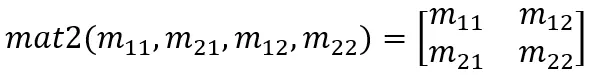

### 一、变量类型

| 类型                | 说明                       | 案例                               |
| ------------------- | -------------------------- | ---------------------------------- |
| float               | 浮点数                     | float a = 1.0; float b = 2.;       |
| int                 | 整数                       | int a = 1;                         |
| bool                | 布尔                       | bool a = true; bool b = false;     |
| vec2、vec3、vec4    | 二维、三维、四维浮点数向量 | vec2 a = vec2(1.0, 2.0);           |
| bvec2、bvec3、bvec4 | 布尔向量                   | bvec2 a = bvec2(true);             |
| ivec2、ivec3、ivec4 | 整数向量                   | ivec2 a = ivec2(1, 2);             |
| mat2、mat3、mat4    | 二维、三维、四维矩阵       | mat2 a = mat2(1.0, 2.0, 3.0, 4.0); |
| sampler2D           | 纹理采样器                 | sampler2D a;                       |
| samplerCube         | 立方体纹理采样器           | samplerCube a;                     |

说明：mat2、mat3、mat4 中的元素都是按照**列向量**的顺序排列的，即 mat2 m = mat2(m11, m21, m12, m22) 对应的公式如下。<br/>


### 二、内置变量

| 范围                     | 变量                            | 说明                                                                                                                                                                                                                   |
| ------------------------ | ------------------------------- | ---------------------------------------------------------------------------------------------------------------------------------------------------------------------------------------------------------------------- |
| 顶点着色器的 Output 变量 | highp vec4 **gl_Position;**     | 顶点坐标信息                                                                                                                                                                                                           |
| 顶点着色器的 Output 变量 | mediump float **gl_PointSize**; | 顶点大小 (只在 GL_POINTS 图元模式下有效)                                                                                                                                                                               |
| 片元着色器的 Input 变量  | mediump vec4 **gl_FragCoord**;  | 片元在屏幕空间的坐标，假设屏幕宽高分别为 width、height <br/> x: 片元的 x 坐标，值域 [0, width - 1] <br/> y: 片元的 x 坐标，值域 [0, height - 1] <br/> z: 片元的深度坐标，值域 [0, 1] <br/> w: 总是 1，通常用于透视除法 |
| 片元着色器的 Input 变量  | bool **gl_FrontFacing**;        | 标志当前图元是否是正面图元的一部分                                                                                                                                                                                     |
| 片元着色器的 Output 变量 | mediump vec4 **gl_FragColor**;  | 设置当前片点的颜色                                                                                                                                                                                                     |

### 三、Uniforms

你可以把 uniforms 想象成连通 GPU 和 CPU 的许多小的桥梁。虽然这些 uniforms 的名字千奇百怪，但是在这一系列的例子中我一直有用到：u_time （时间）, u_resolution （画布尺寸）和 u_mouse （鼠标位置）。

```GLSL
#ifdef GL_ES
precision mediump float;
#endif

uniform vec2 u_resolution; // 画布尺寸（宽，高）
uniform vec2 u_mouse;      // 鼠标位置（在屏幕上哪个像素）
uniform float u_time;     // 时间（加载后的秒数）
```
