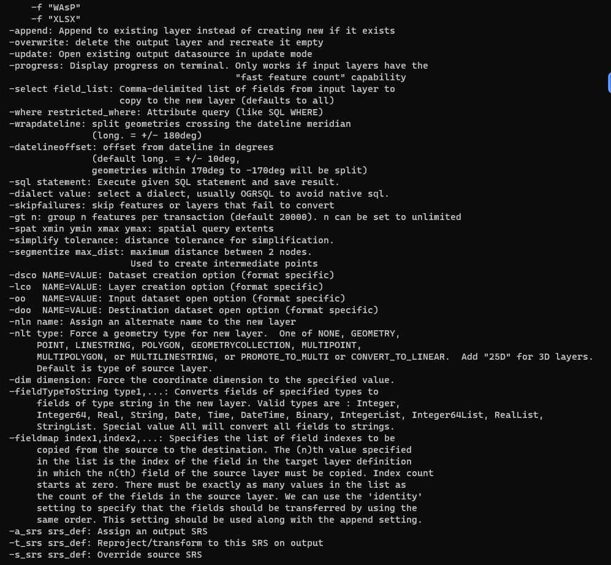

# 使用 GDAL 对数据集转换坐标系以及转换格式

```kotlin
    gdal.AllRegister()
    val dataset = gdal.OpenEx("F:\\files\\shp\\1698817993242\\BGD.shp")
//    val spatialReference = SpatialReference();
//    spatialReference.ImportFromEPSG(4326);
//    val wkt = spatialReference.ExportToWkt()
//    println(wkt)
    val vector: Vector<String> = Vector();
    vector.addElement("-overwrite")
//    vector.addElement("-skipfailures")
    vector.addElement("-t_srs")
    vector.addElement("EPSG:4326")
    val vectorOption = VectorTranslateOptions(vector);
    gdal.VectorTranslate("F:\\files\\shp\\geojson\\BGD.geojson", dataset, vectorOption)

```

注：可选参数同 `ogr2ogr --long-usage`


#### 参考

> 1. [https://www.cnblogs.com/zqctzk/p/11819352.html](https://www.cnblogs.com/zqctzk/p/11819352.html)
> 2. [https://github.com/OSGeo/gdal/blob/33d6db38db8fc4a9f7028f5a5c9e0a5e749553d9/swig/java/apps/ogr2ogr_new.java](https://github.com/OSGeo/gdal/blob/33d6db38db8fc4a9f7028f5a5c9e0a5e749553d9/swig/java/apps/ogr2ogr_new.java)
