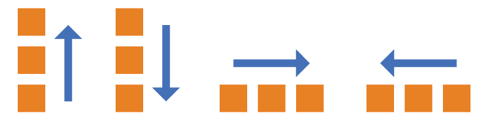
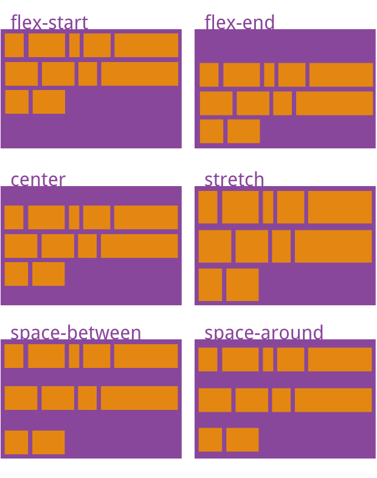
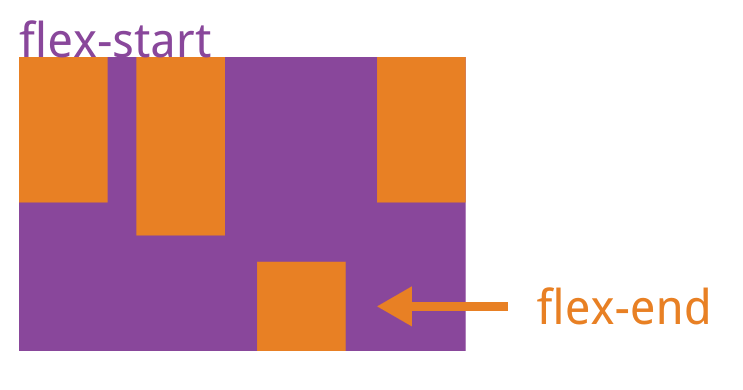

# flex 布局总结

### 一、设置为 flex 布局

- 块级元素：

```css
display: flex;
```

- 行内元素：

```css
display: inline-flex;
```

- Webkit 内核的浏览器：

```css
display: -webkit-flex; /* Safari */
display: flex;
```

### 二、容器的属性

- flex-direction
- flex-wrap
- flex-flow
- justify-content
- align-items
- align-content

#### 2.1 flex-direction 属性

`flex-direction`属性决定主轴的方向（即项目的排列方向）。它可能有 4 个值:

- row（默认值）：主轴为水平方向，起点在左端。
- row-reverse：主轴为水平方向，起点在右端。
- column：主轴为垂直方向，起点在上沿。
- column-reverse：主轴为垂直方向，起点在下沿。

  

#### 2.2 flex-wrap 属性

`flex-wrap`属性定义，如果一条轴线排不下，如何换行

```css
.box {
  flex-wrap: nowrap | wrap | wrap-reverse;
}
```

#### 2.3 flex-flow

`flex-flow`属性是`flex-direction`属性和`flex-wrap`属性的简写形式

#### 2.4 justify-content 属性

`justify-content`属性定义了项目在主轴(水平方向)上的对齐方式

```css
.box {
  justify-content: flex-start | flex-end | center | space-between | space-around;
}
```

#### 2.5 align-items 属性

`align-items`属性定义项目在交叉轴(垂直方向)上如何对齐。

```css
.box {
  align-items: flex-start | flex-end | center | baseline | stretch;
}
```

#### 2.6 align-content 属性

`align-content`属性定义了多根轴线(多行)的对齐方式。如果项目只有一根轴线，该属性不起作用。

```css
.box {
  align-content: flex-start | flex-end | center | space-between | space-around |
    stretch;
}
```



### 三、项目的属性

- <a href="#_3-1-order-属性" >order</a>
- <a href="#_3-2-flex-grow-属性" >flex-grow</a>
- <a href="#_3-3-flex-shrink-属性" >flex-shrink</a>
- <a href="#_3-4-flex-basis-属性" >flex-basis</a>
- <a href="#_3-5-flex-属性" >flex</a>
- <a href="#_3-6-align-self-属性" >align-self</a>

#### 3.1 order 属性

`order`属性定义项目的排列顺序,数值越小，排列越靠前，默认为 0。

```css
.item {
  order: <integer>;
}
```

#### 3.2 flex-grow 属性

`flex-grow`属性定义项目的放大比例，默认为 0，即如果存在剩余空间，也不放大

```css
.item {
  flex-grow: <number>; /* default 0 */
}
```

#### 3.3 flex-shrink 属性

`flex-shrink`属性定义了项目的缩小比例，默认为 1，即如果空间不足，该项目将缩小。

```css
.item {
  flex-shrink: <number>; /* default 1 */
}
```

如果所有项目的`flex-shrink`属性都为 1，当空间不足时，都将等比例缩小。如果一个项目的`flex-shrink`属性为 0，其他项目都为 1，则空间不足时，前者不缩小。

#### 3.4 flex-basis 属性

`flex-basis`属性定义了在分配多余空间之前，项目占据的主轴空间（main size）。浏览器根据这个属性，计算主轴是否有多余空间。它的默认值为 auto，即项目的本来大小。

```css
.item {
  flex-basis: <length> | auto; /* default auto */
}
```

它可以设为跟`width`或`height`属性一样的值（比如 350px），则项目将占据固定空间

#### 3.5 flex 属性

`flex`属性是`flex-grow`, `flex-shrink` 和 `flex-basis`的简写

#### 3.6 align-self 属性

`align-self`属性允许单个项目有与其他项目不一样的对齐方式，可覆盖`align-items`属性。默认值为`auto`，表示继承父元素的`align-items`属性，如果没有父元素，则等同于`stretch`。

```css
.item {
  align-self: auto | flex-start | flex-end | center | baseline | stretch;
}
```



#### 参考

> [https://ruanyifeng.com/blog/2015/07/flex-grammar.html](https://ruanyifeng.com/blog/2015/07/flex-grammar.html)
