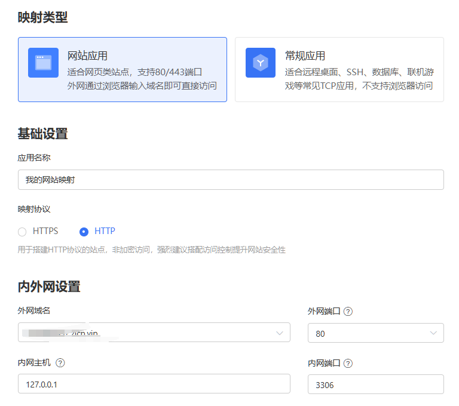
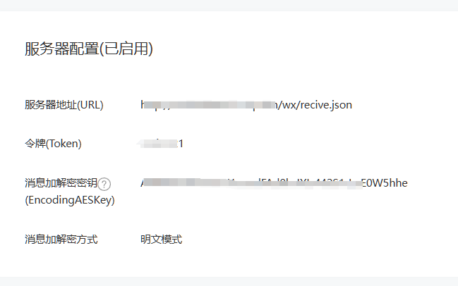

# 搭建简易 Koa 并对接微信自动回复

### 0.前言

因最近想做一个公众号的自动回复功能，便有了这篇文章。至于后台 server 的选择，做一个小的 server 就行，便没有必要用 Midway，便手写一个简单的 koa。

### 1.搭建后台 server

```ts
import * as Koa from "koa";
const koa = require("koa");
const bodyParser = require("koa-bodyparser");
import { wx } from "./routes"; //路由

const app: Koa = new koa();

app.use(bodyParser());
app.use(wx.routes());
app.use(wx.allowedMethods());

app.listen(3306, () => console.log(`server is listen:3306`));
```

### 2.编写路由

```ts
import * as koaRouter from "koa-router";
const koa_router = require("koa-router");
const wx: koaRouter = new koa_router();

wx.prefix("/wx");

wx.get("/recive.json", async (ctx, next) => {
  await next();
  console.log("GET请求");
});

wx.post("/recive.json", async (ctx, next) => {
  await next();
  console.log("Post请求");
});

export { wx };
```

\* 这里的地址必须是`.json`结尾，否则收不到微信发送过来的请求

### 3.添加功能代码

```ts
import * as koaRouter from "koa-router";
const koa_router = require("koa-router");
const wx: koaRouter = new koa_router();
import { SHA1 } from "crypto-js";
import { parseStringPromise } from "xml2js";

wx.prefix("/wx");
// get请求用来对接时验证
wx.get("/recive.json", async (ctx, next) => {
  await next();
  console.log("GET请求");
  const { signature, echostr, timestamp, nonce } = ctx.request.query;
  const token = "[token]"; //自己设置一个token，后边在公众号平台配置
  const arr = [token, timestamp, nonce];
  arr.sort();
  const s = arr.join().replace(/\,/g, "");
  if (SHA1(s).toString() == signature) {
    ctx.response.body = echostr;
    ctx.status = 200;
  } else {
    ctx.body = { code: -1, msg: "fail" };
    ctx.status = 500;
  }
});
// Post请求用来处理收到的消息
wx.post("/recive.json", async (ctx, next) => {
  await next();
  console.log("Post请求");
  ctx.req.setEncoding("utf-8");
  let xml = "";
  ctx.req.on("data", async (x) => {
    xml += x;
  });
  //   xml转json
  const { ToUserName, FromUserName, Content } = await new Promise<any>(
    (resolve) => {
      ctx.req.on("end", async () => {
        const data = await parseStringPromise(xml);
        resolve(data.xml);
      });
    }
  );

  const resMsg = "";

  ctx.status = 200;
  ctx.res.setHeader("Content-Type", "application/xml");
  //   这里只演示了回复文字，具体参考： https://developers.weixin.qq.com/doc/offiaccount/Message_Management/Passive_user_reply_message.html
  ctx.res.end(`<xml>
      <ToUserName><![CDATA[${FromUserName[0]}]]></ToUserName>
      <FromUserName><![CDATA[${ToUserName[0]}]]></FromUserName>
      <CreateTime>${Date.now()}</CreateTime>
      <MsgType><![CDATA[text]]></MsgType>
      <Content><![CDATA[${resMsg}]]></Content>
    </xml>`);
});

export { wx };
```

### 4.公网地址配置

因为微信服务器需要通过公网来与我们的服务器进行交互，所以我们需要有一个公网地址。（有公网 ip 或者域名的跳过此步）

- 使用花生壳（https://hsk.oray.com/）
  1. 下载安装花生壳客户端
  2. 配置映射
     

### 5.微信公众号平台配置



**参考**

> [微信官方文档](https://developers.weixin.qq.com/doc/offiaccount/Getting_Started/Overview.html)
