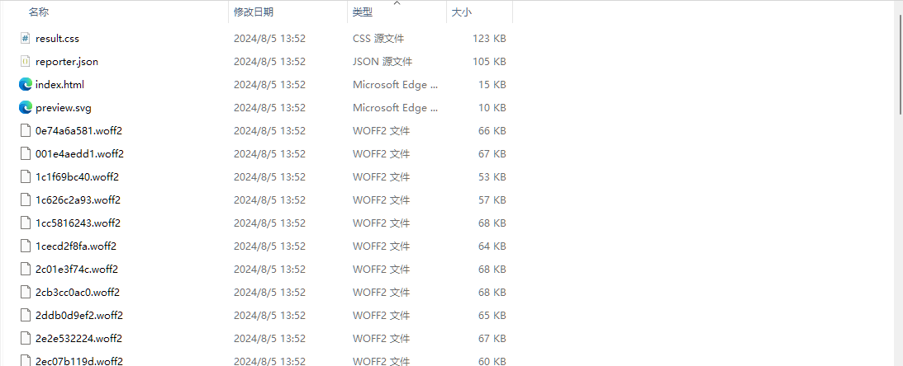

# 在网站使用指定的字体

### 背景

鉴于最近又刷到一些因为字体导致的侵权问题，趁网站改版之际，便想在自己的网站使用[Misans](https://hyperos.mi.com/font)。

### 开始导入

起初直接使用的是 ttf 导入，~~文件也太大了~~，但是文件太大，严重影响加载效率。于是，查看 Misans 官网的引入方式：

Misans 地址: `https://cdn-font.hyperos.mi.com/font/css?family=MiSans:100,200,300,400,450,500,600,650,700,900:Chinese_Simplify,Latin&display=swap`，
返回的文件为：

```css
@font-face {
  font-family: MiSans;
  font-weight: 100;
  font-display: swap;
  src: url("https://cdn-file.hyperos.mi.com/mi-font-service/misans/100/cs.ed078bc4e798bff8.0.woff2")
      format("woff2"), url("https://cdn-file.hyperos.mi.com/mi-font-service/misans/100/cs.ed078bc4e798bff8.0.woff")
      format("woff"),
    url("https://cdn-file.hyperos.mi.com/mi-font-service/misans/100/cs.ed078bc4e798bff8.0.ttf")
      format("truetype"), url("https://cdn-file.hyperos.mi.com/mi-font-service/misans/100/cs.ed078bc4e798bff8.0.eot")
      format("embedded-opentype");
  unicode-range: U+20, U+2013-2014, U+2018-2019, U+201c-201d...;
}
....;
```

分析这段代码：`font-family`和`font-weight` 匹配时请求 `src`对应的文件，重点在`unicode-range`，也就是只有网站有在这个范围的文字时，才会请求对应的文件，也就是说对字体文件进行拆分，这样可以大大减小请求资源的 size, 至于 woff2 和 ttf 等各类字体区别参考：

> [https://www.cnblogs.com/bianchengsanmei/p/15857883.html](https://www.cnblogs.com/bianchengsanmei/p/15857883.html)

### 使用工具进行字体文件的拆分

- 工具 ： [cn-font-split](https://github.com/KonghaYao/cn-font-split)

- 操作： <br/>
  运行后生成的目录结构为：
  
  我们可以直接导入生成的`result.css`，便可以在我们的网站使用对应的字体了，有需要的话可以修改这个 css 的代码。

### 其他一些关于字体

1. 设置多个字体用`,`隔开，最后设置`sans-serif`

```css
font-family: "MiSans Latin", "MiSans VF", sans-serif;
```
