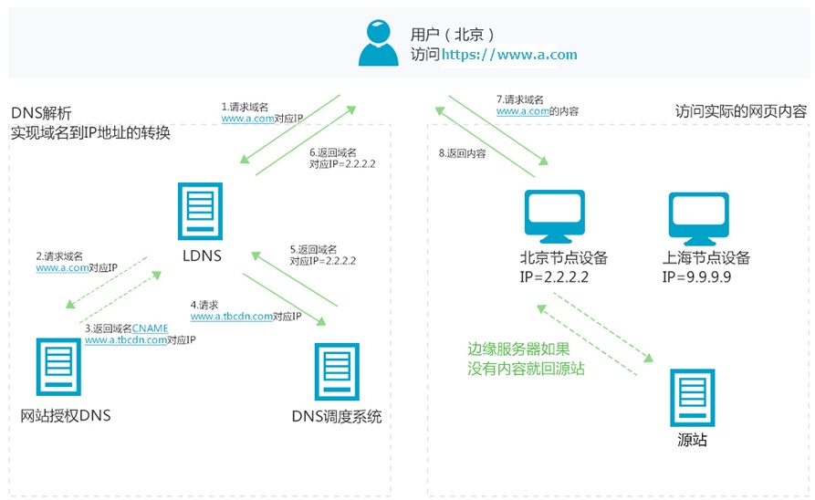
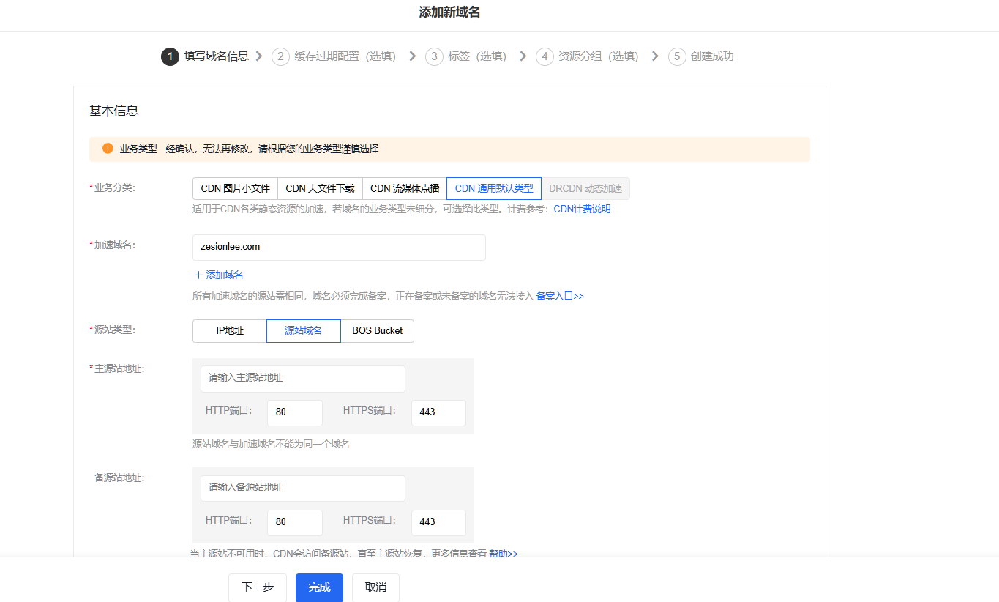

# 配置自己的 cdn 进行网站和资源加速

### 背景

碍于西数的主机不能进行设置字体的跨域，刚好想试一下 cdn 进行加速。

### 关于 CDN

#### 1. 什么是 CDN

CDN 英文全称`Content Delivery Network`，中文翻译即为内容分发网络。它是建立并覆盖在承载网之上，由分布在不同区域的边缘节点服务器群组成的分布式网络。

CDN 应用广泛，支持多种行业、多种场景内容加速，例如：图片小文件、大文件下载、视音频点播、直播流媒体、全站加速、安全加速。

#### 2. CDN 工作原理

CDN 的工作原理就是将源站的资源缓存到位于全国各地的 CDN 节点上，用户请求资源时，就近返回节点上缓存的资源，而不需要每个用户的请求都回您的源站获取，避免网络拥塞、分担源站压力，保证用户访问资源的速度和体验

#### 3. CDN 与传统网站访问的区别

CDN 主要功能是在不同的地点缓存内容，通过负载均衡技术，将用户的请求定向到最合适的缓存服务器上去获取内容，比如说，是北京的用户，我们让他访问北京的节点，深圳的用户，我们让他访问深圳的节点。通过就近访问，加速用户对网站的访问。解决 Internet 网络拥堵状况，提高用户访问网络的响应速度。

> 参考 [https://cloud.tencent.com/developer/article/1779335](https://cloud.tencent.com/developer/article/1779335)

### 配置百度云 CDN

1. 填写 CDN 配置信息

   

   - 加速域名：配置后要访问的 cdn 的域名
   - 源站类型：可以是 IP 地址、源站域名或者是 BOS（对象存储）
   - 主源站地址：要加速的源 IP 地址或者源域名

2. 配置原域名的解析

   将配置完成后提供的 cname 配置到源域名解析的解析表

3. 配置跨域访问

为了方便在调试过程中调用 CDN 的资源，可以对 CDN 进行跨域访问的配置

在`访问控制`-`跨域访问配置`中配置跨域访问规则：

