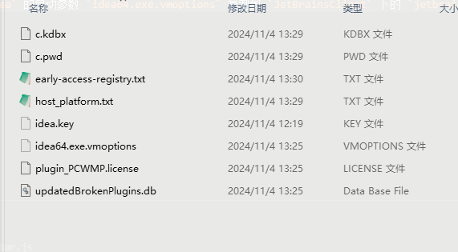

# 解决 IDEA 远程开发连接失败的问题

UOS 默认的 sshd 关闭了 tcp 和端口转发需要手动开启，`vim /etc/ssh/sshd_config`

```
AllowTcpForwarding yes
AllowAgentForwarding yes
```

#### 附：远程连接后显示未激活的问题

将`C:\Users\[用户名]\AppData\Roaming\JetBrains` 文件夹下 `IntelliJIdea` 的启动参数 `idea64.exe.vmoptions` 复制到 `JetBrainsClient` 下的 `jetbrains_client64.exe.vmoptions`,这些文件也可以替换一下


