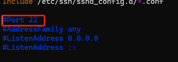

# ubuntu 修改 SSH 端口 和 配置防火墙

### 修改 SSH 端口

1. 编辑 ssh 配置文件

```bash
vim /etc/ssh/sshd_config
```

2. 取消注释，修改端口



3. 重启服务

```bash
 sudo systemctl restart ssh
```

4. 重启服务器吧

```bash
sudo reboot
```

### 配置防火墙

1. 查看防火墙状态

```bash
sudo ufw status

sudo ufw status numbered # 带数字
```

2. 开启防火墙

```bash
sudo ufw enable
```

3. 添加规则

```bash
sudo ufw allow  2233/tcp #允许端口
sudo ufw app list        #查看可设置的应用
sudo ufw allow  Samba    #允许应用
```

4. 按数字删除

```bash
sudo ufw delete 2
```

5. ufw usage:

```bash
Usage: ufw COMMAND

Commands:
 enable                          enables the firewall
 disable                         disables the firewall
 default ARG                     set default policy
 logging LEVEL                   set logging to LEVEL
 allow ARGS                      add allow rule
 deny ARGS                       add deny rule
 reject ARGS                     add reject rule
 limit ARGS                      add limit rule
 delete RULE|NUM                 delete RULE
 insert NUM RULE                 insert RULE at NUM
 prepend RULE                    prepend RULE
 route RULE                      add route RULE
 route delete RULE|NUM           delete route RULE
 route insert NUM RULE           insert route RULE at NUM
 reload                          reload firewall
 reset                           reset firewall
 status                          show firewall status
 status numbered                 show firewall status as numbered list of RULES
 status verbose                  show verbose firewall status
 show ARG                        show firewall report
 version                         display version information

Application profile commands:
 app list                        list application profiles
 app info PROFILE                show information on PROFILE
 app update PROFILE              update PROFILE
 app default ARG                 set default application policy
```

附：[Ufw 使用指南](https://wiki.ubuntu.com.cn/Ufw%E4%BD%BF%E7%94%A8%E6%8C%87%E5%8D%97)
