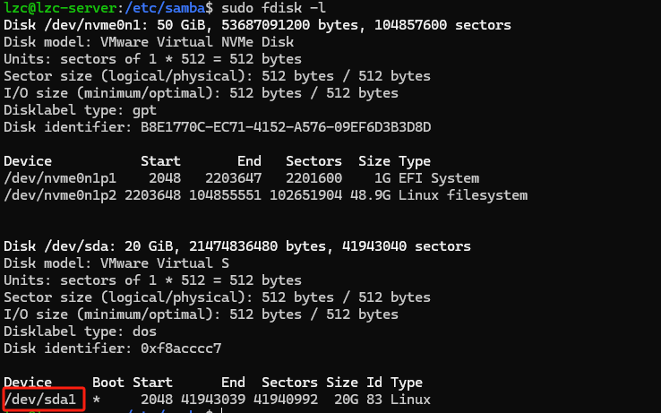
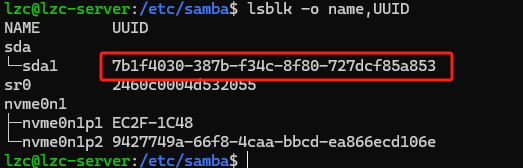

# ubuntu 挂载硬盘 和 搭建 Samba 服务

### 一、挂载硬盘

#### 手动临时挂载分区

1. 获取硬盘列表

```bash
sudo fdisk -l
```



2. 使用设备名称挂载

```bash
sudo mkdir -p /media/disk0
sudo mount /dev/sda1  /media/disk0
```

#### 开机自动挂载

为防止名称的变化，使用 UUID 挂载硬盘

1. 获取分区的 UUID

```bash
lsblk -o name,UUID

```



2. 编辑 `/etc/fstab`

```bash
/dev/disk/by-uuid/7b1f4030-387b-f34c-8f80-727dcf85a853  /media/disk0
```

### 二、搭建 Samba 服务

1. 安装 Samba

```bash
sudo apt install samba
```

2. 创建共享目录 并 设置权限

```bash
sudo mkdir -p /srv/samba/shared
sudo chown nobody:nogroup /srv/samba/shared
sudo chmod 2775 /srv/samba/shared

```

3. 配置 Samba `sudo vim /etc/samba/smb.conf`

```bash
[shared]
   path = /srv/samba/shared # 路径
   browsable = yes  # 是否允许在网络邻居中浏览此共享。
   read only = no # 是否只读
   guest ok = no # 是否允许匿名访问
   create mask = 0775
   directory mask = 0775
```

4. Samba 用户配置

```bash
adduser your_username #添加用户 用已经存在用户的跳过此步骤

smbpasswd -a your_username  # 设置smb访问密码
smbpasswd -e your_username  # 启用用户
```

5. 重启 Samba 服务

```bash
sudo systemctl restart smbd
```

6. 开启防火墙的需要添加规则

```bash
sudo ufw allow samba
```

7. 解决 windows 不能连接的问题

```bash
# 禁用访客
usershare allow guests = no
map to guest = never
```

#### 参考

1. [Ubuntu 22.04 上快速搭建 Samba 文件共享服务器](https://www.bilibili.com/opus/1000689957920047113)
2. [解决 Win10 / 11 客户机无法访问 Samba 服务器的问题](https://zhuanlan.zhihu.com/p/689077877)
