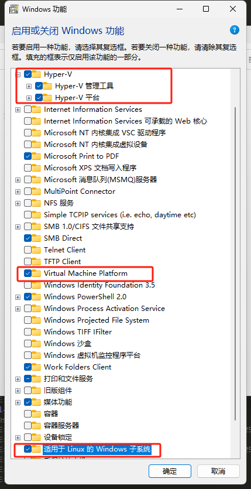

#### 前言

最近要使用 ubunt 进行开发，安装一个虚拟机太耗资源，正好有 wsl，所以安装 wsl 进行 ubuntu 的开发 。讲真，这个确实比虚拟机好用，尤其是 wsl2，可以直接调用主主机的 GPU（亲测好用）。话不多说，开始今天的正文部分。

贴一个 wsl 的微软的官网吧。

> https://learn.microsoft.com/zh-cn/windows/wsl/install

### 一、安装 wsl

- 直接用命令行安装：

```cmd
wsl  --install
```

- 还需要确保开启了以下功能(`控制面板`-`程序`- `启动或关闭windows功能`)



### 二、 安装 Linux 分发版本

#### （1）安装微软官方的镜像

这种方式可以参考：

> https://learn.microsoft.com/zh-cn/windows/wsl/install-manual#downloading-distributions

#### （2）使用镜像导入

1. 下载 Ubuntu 官方 RootFS
   Ubuntu 官方提供了原始的 minimal root 文件系统（tar 包），可以直接下载。对于 24.04，你可以从这里下载（官方每日构建）：

```
https://cloud-images.ubuntu.com/releases/24.04/release/

#debian RootFS ：https://cdimage.debian.org/cdimage/ports/latest/hurd-amd64/

```

根据自己的平台和需要选择适当的包下载 例如：`ubuntu-24.04-server-cloudimg-amd64-root.tar.xz`

2. 导入为 WSL 实例

```cmd
wsl --import Ubuntu-24.04-Clean D:\WSL\Ubuntu-24.04-Clean D:\Images\ubuntu-24.04-rootfs.tar

```

- Ubuntu-24.04-Clean 实例名称
- D:\WSL\Ubuntu-24.04-Clean 虚拟盘路径

3. 启动实例

```cmd
wsl -d Ubuntu-24.04-Clean
```

4. 首次进入后执行以下初始化命令

```bash
adduser yourname
usermod -aG sudo yourname
```

#### （3）使用自己导出的镜像导入

镜像导出命令：`wsl --export Ubuntu my-ubuntu-backup.tar`

然后就可以参照 （2） 中的方法进行导入

### 三、其他一些 wsl 操作

- 查看所有实例：`wsl --list --verbose`
- 启动和使用新实例：`wsl -d <实例名称>`
- 删除某个实例： `wsl --unregister <实例名称>`
- 镜像导出命令：`wsl --export Ubuntu my-ubuntu-backup.tar`
- 导入镜像命令： `wsl --import <新实例名称> <安装路径> <镜像文件路径>`
- 关闭 所有正在运行的 WSL 实例 : `wsl --shutdown`
- 强制关闭某个实例 : `wsl --terminate <实例名称>`
