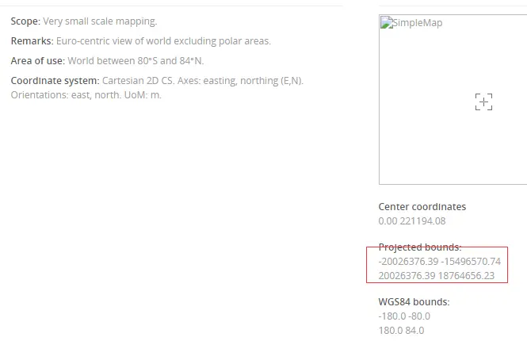
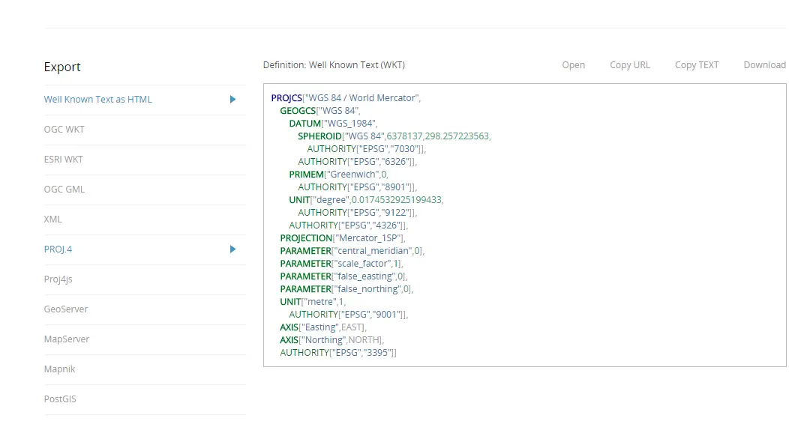

## 一、确定坐标系的定义

1. 访问网站 http://epsg.io 查找坐标系：
   

2. 选择 proj4.js 方式引入
   
3. 复制代码

```js
proj4.defs(
  "EPSG:4528",
  "+proj=tmerc +lat_0=0 +lon_0=120 +k=1 +x_0=40500000 +y_0=0 +ellps=GRS80 +units=m +no_defs"
);
```

## 二、引入 proj4.js

在线引入地址（参考）：[https://cdn.jsdelivr.net/npm/proj4@2.7.5/dist/proj4.js](https://cdn.jsdelivr.net/npm/proj4@2.7.5/dist/proj4.js)

## 三、坐标系转换

```js
import { fromLonLat, transform } from "ol/proj";
import { register } from "ol/proj/proj4";

proj4.defs(
  "EPSG:4528",
  "+proj=tmerc +lat_0=0 +lon_0=120 +k=1 +x_0=40500000 +y_0=0 +ellps=GRS80 +units=m +no_defs"
);

register(proj4);
```

## 四、测试坐标系转换

```js
ol.proj.transform([118, 32], "EPSG:4326", "EPSG:4528"); //这种如果测试成功，代表定义成功了。
```

参考文章：[https://www.jianshu.com/p/9eca1bc8a12d](https://www.jianshu.com/p/9eca1bc8a12d)
