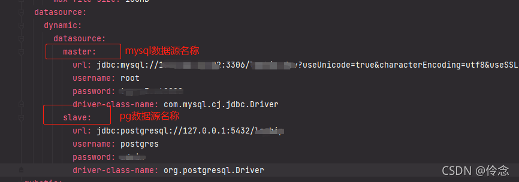
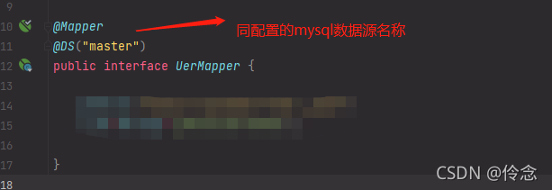

## 一.开发环境：

springboot 2.2.12.RELEASE、mysql 8.0.2、postgres 13.2

## 二.安装 maven 依赖

1. mysql 依赖

```xml
        <dependency>
			<groupId>mysql</groupId>
			<artifactId>mysql-connector-java</artifactId>
			<scope>runtime</scope>
		</dependency>
```

2. pg 依赖

```xml
    <dependency>
			<groupId>org.postgresql</groupId>
			<artifactId>postgresql</artifactId>
			<scope>runtime</scope>
	</dependency>
```

3. 多数据源配置依赖

```xml
        <dependency>
			<groupId>com.baomidou</groupId>
			<artifactId>dynamic-datasource-spring-boot-starter</artifactId>
			<version>3.4.0</version>
		</dependency>
```

## 三.添加配置信息



## 四.调用方式

mysql 数据库的查询只需在 mapper 添加注释 `@DS("master")`


原文链接：[https://blog.csdn.net/qq_32259239/article/details/121266278](https://blog.csdn.net/qq_32259239/article/details/121266278)
