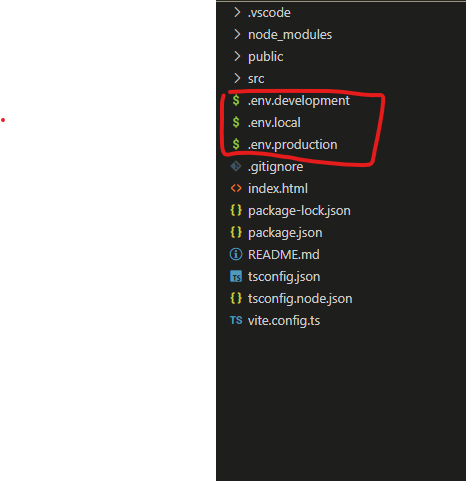
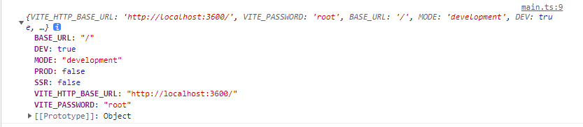

> 参考地址：[https://cn.vitejs.dev/guide/env-and-mode.html#env-variables](https://cn.vitejs.dev/guide/env-and-mode.html#env-variables)

#### 前言

在项目中可以将一些生成环境和开发不同的变量配置在环境中，这样再打包时直接运行打包命令而不用去修改文件

#### 步骤

1. 在项目根目录下新建 `.env.local` `.env.production` `.env.development` 三个文件

```
.env                # 所有情况下都会加载
.env.local          # 所有情况下都会加载，但会被 git 忽略
.env.production     #生产环境
.env.development    #开发环境
```



2. 在文件中添加配置

```
VITE_HTTP_BASE_URL=http://localhost:3600/
```

**注:为了防止意外地将一些环境变量泄漏到客户端，只有以 VITE\_ 为前缀的变量才会暴露给经过 vite 处理的代码**

3. 可以在项目中通过 `import.meta.env` 获取到配置的值

```ts
console.log(import.meta.env);
```



4. 乐意看到有一些在所有情况下都可以使用的内建变量：

- `import.meta.env.MODE`: {string}应用运行的模式
- `import.meta.env.BASE_URL`: {string} 部署应用时的基本 URL。他由 base 配置项决定。
- `import.meta.env.PROD`: {boolean} 应用是否运行在生产环境
- `import.meta.env.DEV`: {boolean} 应用是否运行在开发环境 (永远与 import.meta.env.PROD 相反)
- `import.meta.env.SSR`: {boolean} 应用是否运行在 server 上
